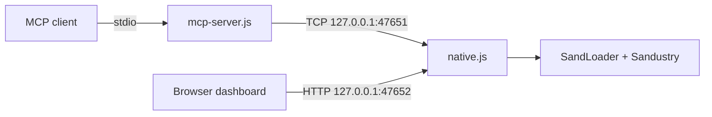

# Sandustry MCP Ultimate Debug Bridge

Give an MCP-compatible AI client live, local access to a running
[Sandustry](https://store.steampowered.com/app/2764460/Sandustry/) session through
[SandLoader](https://github.com/LopeKinz/SandLoader).

The bridge can inspect game state and APIs, diagnose SandLoader and installed
mods, read logs, interact with the renderer, capture screenshots, compare state
snapshots, monitor game events, and perform controlled debugging actions.

| Package | MCP tools | Transport | Dashboard |
|---|---:|---|---|
| **v2.3.0** | **73** | local stdio via `127.0.0.1:47651` | [http://127.0.0.1:47652/](http://127.0.0.1:47652/) |

[Download `sandustry-mcp-ultimate-debug-2.3.0.zip`](https://github.com/LopeKinz/SandLoader-Mods/raw/refs/heads/main/sandustry-mcp-ultimate-debug-2.3.0.zip)

> [!WARNING]
> This is a powerful development and debugging mod, not a read-only telemetry
> plugin. It requests SandLoader's native `node` permission and exposes tools
> that can change the running game. Install it only if you trust the package and
> the MCP client using it.

## Contents

- [How it works](#how-it-works)
- [Requirements](#requirements)
- [Install the mod](#install-the-mod)
- [Connect an MCP client](#connect-an-mcp-client)
- [Verify the setup](#verify-the-setup)
- [Dashboard and HTTP API](#dashboard-and-http-api)
- [What it can do](#what-it-can-do)
- [All 73 MCP tools](#all-73-mcp-tools)
- [Security](#security)
- [Troubleshooting](#troubleshooting)

## How it works

The ZIP contains two cooperating parts:

- `native.js` runs inside Sandustry through SandLoader. It has access to the
  Electron process, the renderer, `SMLN.state`, `SMLN.game`, SandLoader RPC, and
  the local debug dashboard.
- `mcp-server.js` is a dependency-free Node.js stdio server. Your MCP client
  starts it automatically; it translates MCP tool calls into requests to the
  in-game bridge.



Both network listeners bind to loopback only. Nothing is hosted on the public
internet, and the game must be running for live tool calls to work.

## Requirements

- Sandustry installed on a platform supported by SandLoader
- [SandLoader](https://github.com/LopeKinz/SandLoader) installed and working
- Node.js 18 or newer available to the MCP client
- A local MCP client with stdio server support

No `npm install` or build step is required. The adapter uses only Node.js core
modules.

## Install the mod

1. Download [`sandustry-mcp-ultimate-debug-2.3.0.zip`](https://github.com/LopeKinz/SandLoader-Mods/raw/refs/heads/main/sandustry-mcp-ultimate-debug-2.3.0.zip).
2. Start Sandustry with SandLoader.
3. Open **SandLoader Mods → Install from ZIP**.
4. Select the downloaded ZIP.
5. Review and approve the requested native **Node.js** permission.
6. Make sure **Sandustry MCP Ultimate Debug Bridge** is enabled.
7. Restart Sandustry, then load a save.

SandLoader installs the package under its local mod directory. On Windows, the
default path is:

```text
C:\Users\<Windows-user>\AppData\Roaming\sandustry\smln-mods\sandustry-mcp\
```

You can also use **SandLoader Mods → Open folder** and open the
`sandustry-mcp` directory. The file needed by MCP clients is `mcp-server.js`.

## Connect an MCP client

Use an absolute path to the installed `mcp-server.js`. The MCP client should
start this file itself; normally, you do not run `start-mcp.cmd` separately.

### Claude Code, including the VS Code extension

Run this in the terminal where the `claude` command is available:

```powershell
claude mcp add --transport stdio --scope user sandustry -- node "C:\Users\<Windows-user>\AppData\Roaming\sandustry\smln-mods\sandustry-mcp\mcp-server.js"
```

Then verify the registered server:

```powershell
claude mcp get sandustry
claude mcp list
```

Inside Claude Code, `/mcp` shows the connection and its tools. See the official
[Claude Code MCP documentation](https://docs.anthropic.com/en/docs/claude-code/mcp)
for scopes and configuration management.

### Claude Desktop

Open **Settings → Developer → Edit Config**, then add the server to
`claude_desktop_config.json`:

```json
{
  "mcpServers": {
    "sandustry": {
      "command": "node",
      "args": [
        "C:\\Users\\<Windows-user>\\AppData\\Roaming\\sandustry\\smln-mods\\sandustry-mcp\\mcp-server.js"
      ]
    }
  }
}
```

Save the file and completely restart Claude Desktop. Windows stores this config
at `%APPDATA%\Claude\claude_desktop_config.json`. The MCP project also provides a
general [local-server configuration guide](https://modelcontextprotocol.io/docs/2026-07-28/develop/connect-local-servers).

### Other stdio MCP clients

Use the same command and absolute argument in the client's local-server config:

```json
{
  "command": "node",
  "args": ["C:\\absolute\\path\\to\\sandustry-mcp\\mcp-server.js"]
}
```

This is a local stdio MCP server. The URL on port `47652` is a dashboard and
debug HTTP API; it is **not** a Streamable HTTP MCP endpoint.

## Verify the setup

Check each layer in this order:

1. Start Sandustry with the mod enabled and load a save.
2. Open [http://127.0.0.1:47652/api/health](http://127.0.0.1:47652/api/health).
3. Ask the MCP client to call `sandustry_status`.
4. Confirm the response reports the bridge, Electron, SandLoader, and game as
   ready.

To verify the stdio adapter and inspect its tool definitions without connecting
to the game:

```powershell
node "C:\absolute\path\to\sandustry-mcp\mcp-server.js" --print-tools
```

That command should print a JSON array containing 73 tools and then exit. It
validates the adapter, but a live `sandustry_status` call is still required to
verify the in-game bridge.

Useful first prompts:

- `Check the Sandustry bridge status and report any problems.`
- `List the available Sandustry game API namespaces.`
- `Show the current player position and inspect the nearby cell.`
- `Read the latest SandLoader log and summarize errors only.`
- `Capture two state snapshots around this action and explain the difference.`

## Dashboard and HTTP API

With the mod running, open [http://127.0.0.1:47652/](http://127.0.0.1:47652/)
in a browser. The bundled dashboard provides live status, logs, metrics, state
browsing, array pagination and search, API inspection, event data, mod problems,
and a searchable catalog of all MCP tool schemas.

Available routes:

| Method | Route | Purpose |
|---|---|---|
| `GET` | `/` | Live dashboard |
| `GET` | `/api/health` | Lightweight service and port check |
| `GET` | `/api/status` | Full bridge/game status |
| `GET` | `/api/tools` | Complete MCP tool catalog and JSON schemas |
| `POST` | `/api/call` | Direct native bridge call |

Example status request:

```js
fetch('/api/status')
  .then((response) => response.json())
  .then(console.log)
```

Example state inspection from the dashboard's own browser console:

```js
fetch('/api/call', {
  method: 'POST',
  headers: { 'Content-Type': 'application/json' },
  body: JSON.stringify({
    method: 'inspectState',
    params: { path: 'store.player', maxDepth: 4 }
  })
}).then((response) => response.json()).then(console.log)
```

`/api/call` uses the native bridge's camelCase method names, such as
`inspectState`. MCP clients use the snake_case tool names documented below,
such as `inspect_state`.

The HTTP server rejects cross-origin browser requests. Run browser examples on
the page served from `127.0.0.1:47652`, not from an unrelated website.

## What it can do

- Inspect live `SMLN.state`, including arrays with thousands of structures or
  projectiles without collapsing every entry to `[Object]`
- Discover and call `SMLN.game` namespaces and methods
- Inspect SandLoader state, mods, permissions, problems, configuration, patch
  anchors, and reload plans
- Capture renderer console messages, load failures, preload errors, crashes,
  unresponsive events, and SandLoader log tails
- Inspect and interact with the DOM, open DevTools, and issue Chrome DevTools
  Protocol commands
- Read player/world data and create or remove elements and terrain
- Capture, retain, and diff sanitized state snapshots
- Record bounded probes for named FH game events
- Inspect allowed Sandustry, SandLoader, mod, and user-data roots through
  traversal-protected, read-only file tools
- Read process, Electron, OS, renderer-performance, and worker-messaging data
- Capture the current game window as a PNG returned through MCP

## All 73 MCP tools

Every tool exposes a JSON input schema and a read-only or mutating/debug safety
annotation. Use `/api/tools`, the dashboard's **AI Tool Catalog**, or
`mcp-server.js --print-tools` for the full schemas and ready-to-copy MCP
`tools/call` requests.

<details>
<summary><strong>Runtime and windows — 6 tools</strong></summary>

`sandustry_status`, `list_windows`, `open_devtools`, `close_devtools`,
`reload_game_window`, `capture_game_screenshot`

</details>

<details>
<summary><strong>Logs and failures — 4 tools</strong></summary>

`get_console_logs`, `clear_console_logs`, `list_sandloader_logs`,
`read_sandloader_log_tail`

</details>

<details>
<summary><strong>Renderer and Chrome DevTools Protocol — 6 tools</strong></summary>

`renderer_eval`, `inspect_dom`, `performance_snapshot`, `cdp_attach`,
`cdp_detach`, `cdp_command`

</details>

<details>
<summary><strong>DOM interaction — 5 tools</strong></summary>

`dom_computed_style`, `dom_click`, `dom_focus`, `dom_input`, `dom_attributes`

</details>

<details>
<summary><strong>State and large-array inspection — 5 tools</strong></summary>

`state_keys`, `inspect_state`, `state_array_page`, `state_array_item`,
`search_state_array`

</details>

<details>
<summary><strong>Game API, enums, and console — 8 tools</strong></summary>

`list_game_api`, `list_api_members`, `describe_api_namespace`, `call_game_api`,
`list_enum_tables`, `get_enum_value`, `list_console_commands`,
`run_console_command`

</details>

<details>
<summary><strong>SandLoader diagnostics — 4 tools</strong></summary>

`sandloader_rpc`, `get_sandloader_problems`, `get_sandloader_mods`,
`get_loader_state`

</details>

<details>
<summary><strong>Mod configuration, anchors, and reloads — 8 tools</strong></summary>

`get_mod_details`, `get_mod_config`, `set_mod_config`, `reset_mod_config`,
`rescan_patch_anchors`, `reload_mods_plan`, `reload_mods`, `reload_one_mod`

</details>

<details>
<summary><strong>Player and world editing — 7 tools</strong></summary>

`get_player_position`, `set_player_position`, `get_cell_id`, `create_element`,
`remove_element`, `create_terrain`, `remove_terrain`

</details>

<details>
<summary><strong>Scoped file diagnostics — 6 tools</strong></summary>

`get_host_paths`, `list_scoped_dir`, `read_scoped_file`, `stat_scoped_path`,
`hash_scoped_file`, `search_scoped_text`

</details>

<details>
<summary><strong>System and Electron metrics — 2 tools</strong></summary>

`system_metrics`, `webcontents_info`

</details>

<details>
<summary><strong>Worker messaging — 3 tools</strong></summary>

`worker_messaging_stats`, `send_worker_message`, `send_manager_message`

</details>

<details>
<summary><strong>State snapshots and diffs — 5 tools</strong></summary>

`capture_state_snapshot`, `list_state_snapshots`, `get_state_snapshot`,
`diff_state_snapshots`, `clear_state_snapshots`

</details>

<details>
<summary><strong>Game event probes — 4 tools</strong></summary>

`start_game_event_probe`, `get_game_event_probe`, `stop_game_event_probe`,
`list_game_event_probes`

</details>

## Security

- The TCP bridge listens on `127.0.0.1:47651` only.
- The dashboard and HTTP API listen on `127.0.0.1:47652` only.
- Non-loopback TCP connections and cross-origin browser requests are rejected.
- There is no authentication between local processes. Any process already
  running as your user may be able to call the local bridge.
- Do not port-forward, proxy, tunnel, or publicly expose either port.
- Scoped file tools are read-only and reject paths that escape the discovered
  Sandustry, SandLoader, mod, or user-data roots.
- `renderer_eval`, `sandloader_rpc`, and `cdp_command` are intentional full-power
  debugging escape hatches. Review calls before approving them.
- Mutating tools can alter the current session or save data. Back up important
  saves before using automated world or state changes.

## Troubleshooting

| Problem | What to check |
|---|---|
| `ECONNREFUSED 127.0.0.1:47651` | Sandustry is not running, the mod is disabled, its Node permission was not approved, or the game was not restarted after installation. |
| Dashboard does not open | Check that the mod is enabled, then inspect SandLoader Problems or its latest log for an `EADDRINUSE` or native-entrypoint error. |
| `Game API is not ready` | Leave the main menu and load a save before calling game-state tools. |
| MCP client shows no tools | Use an absolute path, verify `node --version`, restart the client, and run `mcp-server.js --print-tools`. |
| MCP client connects but calls fail | The stdio adapter can start without the game; call `sandustry_status` and verify the in-game bridge separately. |
| `EADDRINUSE` | Close another running Sandustry instance or another process already using port `47651` or `47652`. |
| State output contains depth markers | Increase `maxDepth` within the tool's limit, or use `state_array_page` and `state_array_item` for large arrays. |
| Need the real SandLoader failure | Call `get_sandloader_problems`, then `list_sandloader_logs` and `read_sandloader_log_tail`. |

## Package contents

| File | Purpose |
|---|---|
| `smln.mod.json` | SandLoader manifest and native Node permission request |
| `native.js` | In-game TCP bridge, HTTP API, dashboard host, and debug implementation |
| `mcp-server.js` | Dependency-free stdio MCP adapter exposing 73 tools |
| `dashboard.html` | Bundled local live dashboard and AI tool catalog |
| `tool-catalog.json` | Exact MCP tool descriptions, schemas, and safety annotations |
| `claude-desktop-config.example.json` | Minimal local MCP client configuration example |
| `start-mcp.cmd` | Optional Windows launcher for the stdio adapter |
| `README.md` | Documentation bundled with the installable ZIP |

## Compatibility

This package targets the SandLoader and Sandustry APIs available when v2.3.0
was built. A game or loader update may rename state paths, API namespaces, DOM
selectors, or patch/runtime behavior even if the bridge itself still starts.
Use `sandustry_status`, `get_loader_state`, and `get_sandloader_problems` when
testing a new version.

